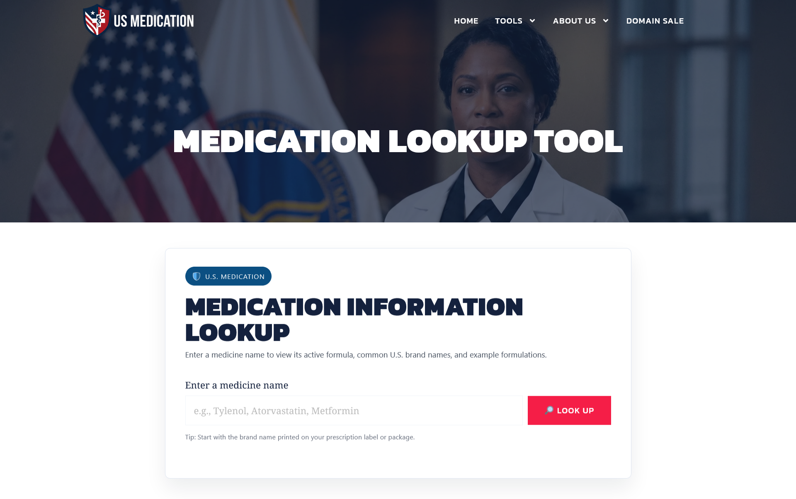
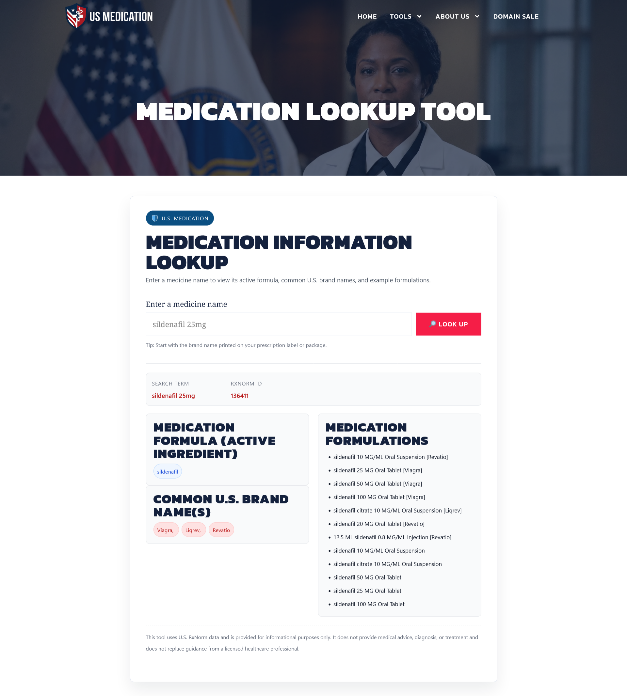
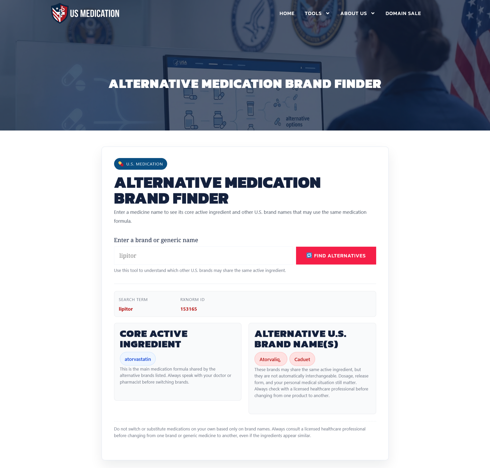
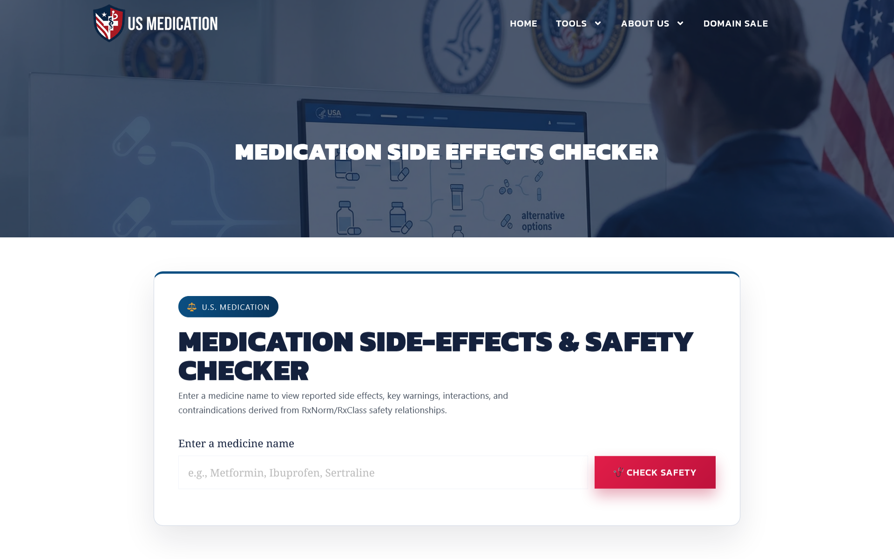
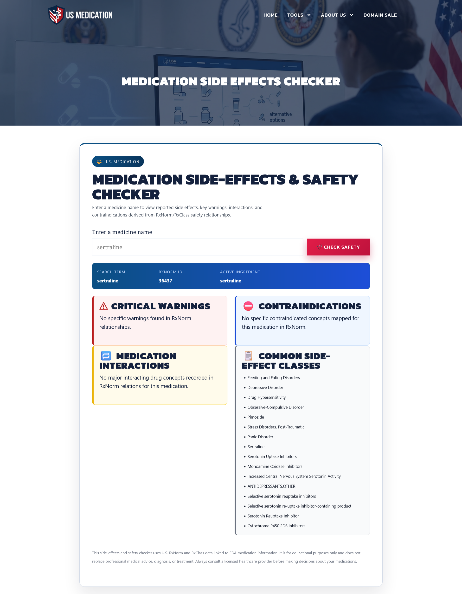

# USMedication Tools – Medication Lookup, Alternative & Side Effects Checker

This project powers a medication tool used on **usmedication.com**.

It helps users:
- Find alternative medications
- Check equivalent brands
- Understand possible side effects
- Compare medicines using reliable data sources

## Official Website & Live Tools

The following links demonstrate the plugin in real-world usage on a live production website:
- 🌐 Website: https://usmedication.com
- 🔍 Medication Lookup Tool: https://usmedication.com/medication-lookup-tool/
- 🔁 Alternate Medication Brand Finder: https://usmedication.com/alternative-medication-brand-finder/
- ⚠️ Side Effects & Safety Checker: https://usmedication.com/medication-side-effects-checker/

## Overview
The tool is designed to assist users with medication-related information by referencing official US health institution data and APIs.  
It focuses on clarity, safety, and responsible presentation of healthcare information.

## Key Features
- Alternative medication checker
- Medication brand equivalence lookup
- Side effects information
- User-friendly WordPress integration

## Usage (Shortcodes)

After installing and activating the plugin, add the following shortcodes to any page or post to display the tools.

### Alternate Medication Brand Finder
[usm_tool type="altbrands"]

### Medication Lookup Tool
[usm_tool type="lookup"]

### Medication Side Effects & Safety Checker
[usm_tool type="sideeffects"]

Each shortcode renders a specific medication tool on the frontend.

## Styling & Customization

The plugin focuses on functionality and data accuracy.  
Basic styling is provided, while the final appearance can be customized using theme or page-level CSS.

This approach allows site owners to:
- Match the tool design with their website theme
- Customize fonts, colors, and spacing
- Control layout and responsiveness without modifying plugin logic

Styling can be applied via the active theme’s custom CSS or page builder styling options.

## Screenshots

### Medication Lookup Tool
**Before search**  

**After results**  

### Alternate Medication Brand Finder
**Before search**  

**After results**  

### Medication Side Effects & Safety Checker
**Before search**  

**After results**  

## My Role
- Founder & product owner
- Designed the product logic and user flows
- Identified and integrated official healthcare data sources
- Orchestrated AI-assisted development for implementation
- Deployed and maintain the live WordPress platform

## Technology
- WordPress
- Custom plugin architecture
- External healthcare APIs
- AI-assisted development tools

## Status
Live and actively used.

## Disclaimer
This tool provides healthcare information only and does not replace professional medical advice.

